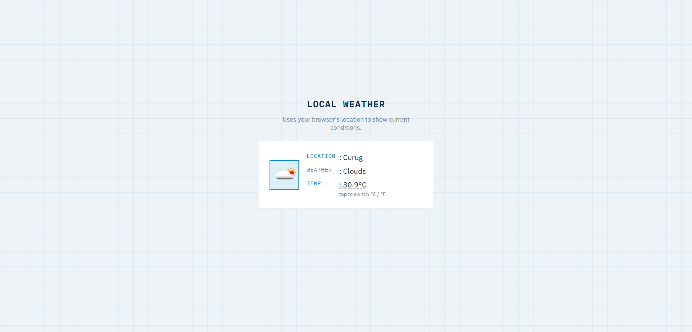

# Local Weather

Shows current weather conditions for your browser's location, with a click-to-toggle
between Celsius and Fahrenheit.

**Live demo:** [hunafazaky.github.io/local-weather-app](https://hunafazaky.github.io/local-weather-app)

## Features

- Requests your location and shows current condition, temperature, and icon
- Click (or press Enter/Space on) the temperature to switch °C / °F
- Clear, specific status messages for permission-denied, unavailable, and timeout
  geolocation errors

## Run Locally

Just open `index.html` in your browser — no install, no build step.

## License

MIT
